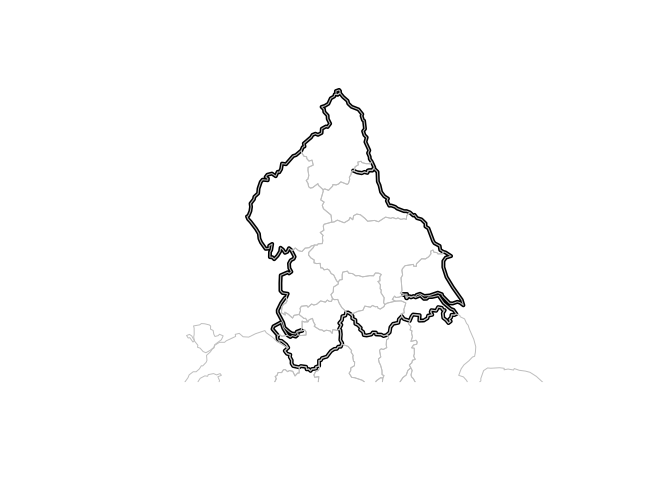

<!-- README.md is generated from README.Rmd. Please edit that file -->

# capcarb

<!-- badges: start -->

<!-- badges: end -->

The goal of capcarb is to …

## Installation

Install from [GitHub](https://github.com/) with:

``` r
# install.packages("devtools")
devtools::install_github("creds2/capcarb")
```

``` r
library(capcarb)
library(tidyverse)
library(tmap)
tmap_mode("view")
```

## Generating input data

There was no readily available boundary data for the TfN region, so it
was constructed as follows, using open data from the Propensity to Cycle
Tool (PCT):

``` r
regions = pct::pct_regions
mapview::mapview(regions)
#> Warning: st_crs<- : replacing crs does not reproject data; use st_transform for
#> that
```


``` r
tfn_zone_text = "manc|yorks|lanc|chesh|liv|north-e|north-y|cumbria|humb"
regions_tfn = regions[grepl(pattern = tfn_zone_text, ignore.case = TRUE, x = regions$region_name), ]
mapview::mapview(regions_tfn)
```


``` r
tfn_region = sf::st_union(regions_tfn)
plot(tfn_region, lwd = 4)
plot(regions, add = TRUE, border = "grey", col = "NA")
```



``` r
tfn_region_27700 = sf::st_transform(tfn_region, 27700)
```

Motorway data was accessed as follows (after pre-cleaning Ordnance
Survey data):

``` r
roads_uk = readRDS("Download_mastermap-roads-2019_1483661.Rds")
names(roads_uk)
```

``` 
 [1] "gml_id"                                            "identifier"                                       
 [3] "beginLifespanVersion"                              "localId"                                          
 [5] "namespace"                                         "fictitious"                                       
 [7] "validFrom"                                         "reasonForChange"                                  
 [9] "roadClassification"                                "routeHierarchy"                                   
[11] "formOfWay"                                         "trunkRoad"                                        
[13] "primaryRoute"                                      "roadClassificationNumber"                         
[15] "operationalState"                                  "provenance"                                       
[17] "length"                                            "length_uom"                                       
[19] "matchStatus"                                       "startGradeSeparation"                             
[21] "endGradeSeparation"                                "averageWidth"                                     
[23] "averageWidth_uom"                                  "minimumWidth"                                     
[25] "minimumWidth_uom"                                  "confidenceLevel"                                  
[27] "inDirection"                                       "inDirection_uom"                                  
[29] "inOppositeDirection"                               "inOppositeDirection_uom"                          
[31] "cycleFacility"                                     "wholeLink"                                        
[33] "roadStructure"                                     "alternateIdentifier|ThematicIdentifier|identifier"
[35] "identifierScheme"                                  "roadName"                                         
[37] "alternateName"                                     "geometry"   
```

``` r
table(roads_uk$roadClassification)
```

``` 
               A Road                B Road Classified Unnumbered              Motorway 
               440770                215962                361711                 16710 
       Not Classified          Unclassified               Unknown 
               363169               2150266               1563113 
```

``` r
motorways_uk = roads_uk[roads_uk$roadClassification == "Motorway", ]
motorways_tfn = motorways_uk[regions_tfn_27700, ]
saveRDS(motorways_tfn, "motorways_tfn.Rds")
```

## Roads in Leeds

``` r
roads_leeds = readRDS("roads_leeds.RDS")
aggregate(roads_leeds$length, by = list(roads_leeds$roadClassification), sum)
#>                 Group.1          x
#> 1                A Road  413116.75
#> 2                B Road   85369.64
#> 3 Classified Unnumbered  178685.63
#> 4              Motorway  202262.91
#> 5        Not Classified  283781.92
#> 6          Unclassified 2339655.83
#> 7               Unknown  613394.89
roads_leeds %>% 
  sf::st_drop_geometry() %>% 
  group_by(roadClassification) %>% 
  summarise(length_km = sum(length) / 1000) %>% 
  ggplot() +
  geom_bar(aes(roadClassification, length_km), stat = "identity")
```


## Motorways in the TfN region

``` r
motorways_tfn = readRDS("motorways_tfn.Rds")

tm_shape(tfn_region_27700) + tm_borders() +
  tm_shape(motorways_tfn) + tm_lines()
#> Linking to GEOS 3.8.0, GDAL 3.0.4, PROJ 7.0.0
```


There are many variables:

``` r
summary(motorways_tfn[1:31])
#>                   gml_id                                     identifier  
#>  osgb4000000007758661:   1   http://data.os.uk/id/4000000007758661:   1  
#>  osgb4000000010837181:   1   http://data.os.uk/id/4000000010837181:   1  
#>  osgb5000005109118625:   1   http://data.os.uk/id/5000005109118625:   1  
#>  osgb4000000010837148:   1   http://data.os.uk/id/4000000010837148:   1  
#>  osgb4000000010840125:   1   http://data.os.uk/id/4000000010840125:   1  
#>  osgb4000000013246084:   1   http://data.os.uk/id/4000000013246084:   1  
#>  (Other)             :5741   (Other)                              :5741  
#>               beginLifespanVersion    localId         
#>  2017-10-19T00:00:00.000:2939      Min.   :4.000e+15  
#>  2018-01-20T00:00:00.000: 447      1st Qu.:4.000e+15  
#>  2018-03-17T00:00:00.000: 299      Median :4.000e+15  
#>  2018-11-18T00:00:00.000: 223      Mean   :4.077e+15  
#>  2019-10-20T00:00:00.000: 139      3rd Qu.:4.000e+15  
#>  2019-05-20T00:00:00.000: 130      Max.   :5.000e+15  
#>  (Other)                :1570                         
#>               namespace    fictitious      validFrom  
#>  http://data.os.uk/:5747   Mode :logical   NA's:5747  
#>                            FALSE:5747                 
#>                                                       
#>                                                       
#>                                                       
#>                                                       
#>                                                       
#>                          reasonForChange             roadClassification
#>  Modified Geometry And Attributes: 693   A Road               :   0    
#>  New                             : 137   B Road               :   0    
#>  Modified Attributes             :4842   Classified Unnumbered:   0    
#>  Modified Geometry               :  75   Motorway             :5747    
#>                                          Not Classified       :   0    
#>                                          Unclassified         :   0    
#>                                          Unknown              :   0    
#>            routeHierarchy                           formOfWay   
#>  Motorway         :5747   Dual Carriageway               :4109  
#>  A Road           :   0   Slip Road                      :1464  
#>  A Road Primary   :   0   Roundabout                     : 144  
#>  B Road           :   0   Traffic Island Link At Junction:  21  
#>  Local Access Road:   0   Single Carriageway             :   9  
#>  Local Road       :   0   Enclosed Traffic Area          :   0  
#>  (Other)          :   0   (Other)                        :   0  
#>  trunkRoad       primaryRoute    roadClassificationNumber
#>  Mode :logical   Mode :logical   M6     : 934            
#>  FALSE:460       FALSE:365       M62    : 756            
#>  TRUE :5287      TRUE :5382      A1(M)  : 631            
#>                                  M60    : 626            
#>                                  M1     : 365            
#>                                  M56    : 332            
#>                                  (Other):2103            
#>            operationalState                                  provenance  
#>  Open              :5747    OS Rural And Interpolated OS Height   :2666  
#>  Under Construction:   0    OS Urban And Interpolated OS Height   :1663  
#>  Permanently Closed:   0    OS Urban And OS Height                : 701  
#>                             OS Rural And OS Height                : 638  
#>                             OS Urban And Low Confidence OS Height :  40  
#>                             OS Moorland And Interpolated OS Height:  21  
#>                             (Other)                               :  18  
#>      length        length_uom                             matchStatus  
#>  Min.   :   1.88   m:5747     Matched                           :5714  
#>  1st Qu.: 113.59              Matched With Attribute Discrepancy:  12  
#>  Median : 318.65              No Match                          :  21  
#>  Mean   : 456.66              Not Matched Awaiting Review       :   0  
#>  3rd Qu.: 577.70                                                       
#>  Max.   :4400.26                                                       
#>                                                                        
#>  startGradeSeparation endGradeSeparation  averageWidth   averageWidth_uom
#>  Min.   :0.0000       Min.   :0.0000     Min.   : 6.20   m   :5650       
#>  1st Qu.:0.0000       1st Qu.:0.0000     1st Qu.:12.30   NA's:  97       
#>  Median :0.0000       Median :0.0000     Median :14.80                   
#>  Mean   :0.2286       Mean   :0.2269     Mean   :15.05                   
#>  3rd Qu.:0.0000       3rd Qu.:0.0000     3rd Qu.:17.00                   
#>  Max.   :1.0000       Max.   :1.0000     Max.   :46.20                   
#>                                          NA's   :97                      
#>   minimumWidth   minimumWidth_uom                    confidenceLevel
#>  Min.   : 4.00   m   :4888        OS Moorland And Full Extent:  28  
#>  1st Qu.: 7.60   NA's: 859        OS Rural And Full Extent   :1869  
#>  Median : 9.20                    OS Rural And Part Extent   :1411  
#>  Mean   :10.25                    OS Urban And Full Extent   :1223  
#>  3rd Qu.:12.03                    OS Urban And Part Extent   :1111  
#>  Max.   :45.70                    OS Moorland And Part Extent:   8  
#>  NA's   :859                      NA's                       :  97  
#>   inDirection      inDirection_uom inOppositeDirection inOppositeDirection_uom
#>  Min.   :  0.000   m:5747          Min.   : 0.000      m:5747                 
#>  1st Qu.:  0.000                   1st Qu.: 0.000                             
#>  Median :  0.900                   Median : 0.800                             
#>  Mean   :  3.141                   Mean   : 2.948                             
#>  3rd Qu.:  3.600                   3rd Qu.: 3.700                             
#>  Max.   :151.900                   Max.   :94.300                             
#>                                                                               
#>                                 cycleFacility           geometry   
#>  Unknown Type Of Cycle Route Along Road:   0   LINESTRING Z :5747  
#>  NA's                                  :5747   epsg:27700   :   0  
#>                                                +proj=tmer...:   0  
#>                                                                    
#>                                                                    
#>                                                                    
#> 
```

The data is quite detailed, as shown below:

``` r
a58m = motorways_tfn %>% 
  dplyr::filter(roadClassificationNumber == "A58(M)")
tm_shape(a58m) + tm_lines("averageWidth", palette = "viridis", lwd = 2)
```


